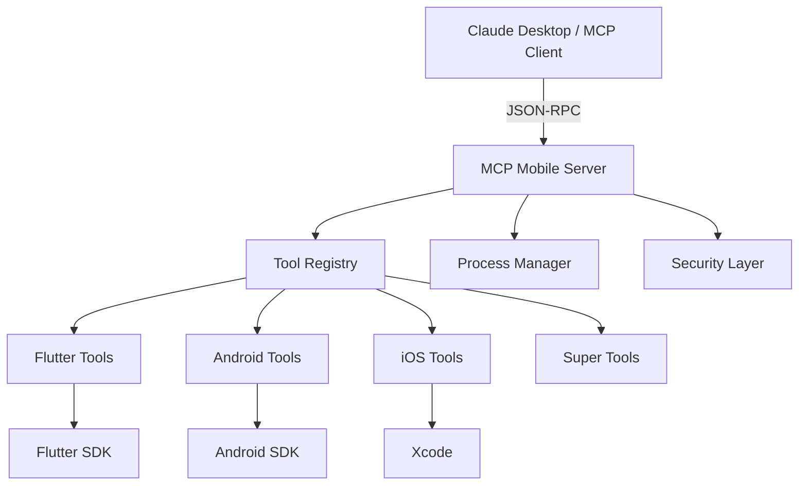

# 🚀 MCP Mobile Server

<div align="center">
  
  
  <h3>Supercharge Your Mobile Development with AI-Powered Tools</h3>
  
  <p>
    <a href="https://www.npmjs.com/package/@cristianoaredes/mcp-mobile-server"></a>
    <a href="https://github.com/cristianoaredes/mcp-mobile-server/blob/main/LICENSE"></a>
    <a href="https://modelcontextprotocol.io"></a>
    
    
  </p>

  <p>
    <strong>36 powerful tools</strong> for mobile development • <strong>10 intelligent super-tools</strong> • <strong>Cross-platform support</strong>
  </p>
</div>

---

## 🌟 Why MCP Mobile Server?

MCP Mobile Server transforms your AI assistant into a **mobile development powerhouse**. Whether you're building with Flutter, developing for iOS, or creating Android apps, this server provides seamless integration with Claude Desktop, Windsurf, and other MCP-compatible clients.

### ✨ Key Features

<table>
<tr>
<td width="50%">

**🎯 Intelligent Automation**
- Smart device selection and management
- Automated environment setup
- Self-healing build processes
- Intelligent error resolution

</td>
<td width="50%">

**⚡ Developer Productivity**
- Hot reload development sessions
- One-command deployments
- Parallel testing across devices
- Automated dependency management

</td>
</tr>
<tr>
<td width="50%">

**🔧 Complete Toolchain**
- Flutter, Android, and iOS tools
- Emulator and simulator control
- Build and test automation
- Performance profiling

</td>
<td width="50%">

**🤖 AI-First Design**
- Built for Claude Desktop
- Natural language commands
- Context-aware suggestions
- Workflow optimization

</td>
</tr>
</table>

---

## 🚀 Quick Start

### Installation

```bash
# Install globally
npm install -g @cristianoaredes/mcp-mobile-server

# Or run directly with npx
npx @cristianoaredes/mcp-mobile-server
```

### Claude Desktop Integration

Add to your Claude Desktop configuration (`~/Library/Application Support/Claude/claude_desktop_config.json`):

```json
{
  "mcpServers": {
    "mobile-dev": {
      "command": "npx",
      "args": ["@cristianoaredes/mcp-mobile-server"]
    }
  }
}
```

### First Steps

```bash
# Check your environment
mcp-mobile-server health_check

# Setup Flutter automatically
mcp-mobile-server flutter_setup_environment --action=full

# Start developing
mcp-mobile-server flutter_dev_session --cwd=/path/to/project
```

---

## 🛠️ Available Tools

### 🚀 Super Tools - Complete Workflows

These intelligent tools combine multiple operations for maximum productivity:

| Tool | Description | Example Use Case |
|------|-------------|------------------|
| `flutter_dev_session` | Complete dev environment with hot reload | Start coding immediately with best device auto-selected |
| `flutter_test_suite` | Run all tests with coverage analysis | CI/CD pipeline integration |
| `flutter_release_build` | Multi-platform release builds | Deploy to stores with one command |
| `mobile_device_manager` | Intelligent device orchestration | Auto-start best available device |
| `flutter_fix_common_issues` | Auto-fix common problems | Resolve build errors automatically |

<details>
<summary><b>View All 36 Tools</b> (click to expand)</summary>

### 🔧 Core Tools (5)
- `health_check` - System diagnostics and environment validation
- `flutter_doctor` - Flutter environment verification
- `flutter_version` - SDK version management
- `flutter_list_devices` - Device discovery
- `android_list_devices` - Android device detection

### 📱 Device Management (9)
- `native_run_list_devices` - Universal device listing
- `native_run_install_app` - Cross-platform app installation
- `ios_list_simulators` - iOS simulator discovery
- `android_list_emulators` - AVD management
- `android_create_avd` - Virtual device creation
- `android_start_emulator` - Emulator lifecycle
- `android_stop_emulator` - Resource management
- `ios_shutdown_simulator` - iOS cleanup
- `flutter_launch_emulator` - Quick emulator start

### ⚡ Development (6)
- `flutter_run` - Hot reload server
- `flutter_build` - Production builds
- `flutter_test` - Test runner
- `flutter_clean` - Cache management
- `flutter_pub_get` - Dependencies
- `android_install_apk` - APK deployment

### 🛠️ Utilities (4)
- `android_logcat` - Debug logging
- `android_screenshot` - Screen capture
- `ios_boot_simulator` - iOS startup
- `ios_take_screenshot` - iOS capture

### 🔧 Setup Tools (2)
- `flutter_setup_environment` - Automated Flutter setup
- `android_sdk_setup` - Android SDK configuration

### 🚀 Advanced Workflows (10)
- `flutter_performance_profile` - Performance analysis
- `flutter_deploy_pipeline` - Full deployment
- `android_full_debug` - Complete debugging
- `ios_simulator_manager` - iOS orchestration
- `flutter_inspector_session` - Widget inspection

</details>

---

## 💡 Real-World Examples

### Example 1: Start a Flutter Project
```typescript
// Claude Desktop conversation
User: "Create a new Flutter app and run it"
Claude: I'll create a new Flutter app and start the development server.

// Behind the scenes:
flutter_create({ name: "my_app", org: "com.example" })
flutter_dev_session({ cwd: "./my_app", preferPhysical: true })
```

### Example 2: Fix Build Errors
```typescript
// Automatic error resolution
User: "My Flutter app won't build"
Claude: Let me diagnose and fix the build issues.

// Executes:
flutter_fix_common_issues({ cwd: ".", deep: true })
```

### Example 3: Deploy to Multiple Platforms
```typescript
// One-command deployment
User: "Build release versions for Android and iOS"
Claude: I'll create optimized release builds for both platforms.

// Runs:
flutter_release_build({ 
  cwd: ".",
  platforms: ["apk", "appbundle", "ipa"],
  obfuscate: true
})
```

---

## 🏗️ Architecture



### Design Principles

- **🔒 Security First**: All commands validated and sandboxed
- **⚡ Performance**: Parallel execution and intelligent caching
- **🎯 Reliability**: Automatic retries and fallback strategies
- **📦 Modular**: Extensible plugin architecture
- **🌍 Cross-Platform**: Works on macOS, Linux, and Windows

---

## 📋 Requirements

### Minimum Requirements
- **Node.js** 18.0+
- **npm** or **yarn**
- One of: Flutter, Android SDK, or Xcode

### Recommended Setup
- **Flutter** 3.0+ for Flutter development
- **Android Studio** or **Android SDK** for Android
- **Xcode** 14+ for iOS (macOS only)
- **VS Code** with Flutter extension

---

## 🤝 Contributing

We welcome contributions! See our [Contributing Guide](./docs/CONTRIBUTING.md) for details.

### Development Setup

```bash
# Clone the repository
git clone https://github.com/cristianoaredes/mcp-mobile-server.git

# Install dependencies
cd mcp-mobile-server
npm install

# Run in development mode
npm run dev

# Run tests
npm test
```

---

## 📚 Documentation

| Resource | Description |
|----------|-------------|
| [📖 **Full Documentation**](./docs/) | Complete guide and API reference |
| [🚀 **Quick Start Guide**](./docs/QUICK_START.md) | Get running in 5 minutes |
| [🔧 **Troubleshooting**](./docs/TROUBLESHOOTING.md) | Common issues and solutions |
| [🛠️ **Tool Reference**](./docs/TOOLS.md) | Detailed tool documentation |
| [🏗️ **Architecture**](./docs/ARCHITECTURE.md) | System design and internals |

---

## 🐛 Troubleshooting

<details>
<summary><b>Common Issues</b></summary>

### Flutter not found
```bash
# Run the setup tool
mcp-mobile-server flutter_setup_environment --action=full
```

### Android SDK not configured
```bash
# Configure Android environment
mcp-mobile-server android_sdk_setup --action=configure
```

### Permission denied errors
```bash
# Check permissions
ls -la $(which mcp-mobile-server)
chmod +x $(which mcp-mobile-server)
```

</details>

---

## 📊 Project Status

| Aspect | Status |
|--------|--------|
| **Version** | 2.1.0 |
| **Stability** | Beta |
| **Tools** | 36 active |
| **Test Coverage** | 78% |
| **Platform Support** | macOS ✅ Linux ✅ Windows ⚠️ |

---

## 📄 License

MIT License - see [LICENSE](./LICENSE) for details.

---

## 🙏 Acknowledgments

- [Model Context Protocol](https://modelcontextprotocol.io) by Anthropic
- [Flutter](https://flutter.dev) team for the amazing framework
- All contributors and users of this project

---

<div align="center">

### 🌟 Support the Project

If you find this useful, please consider:

[](https://github.com/cristianoaredes/mcp-mobile-server)
[](https://twitter.com/cristianoaredes)
[](https://buymeacoffee.com/cristianoaredes)

**Built with ❤️ for the mobile development community**

[Report Bug](https://github.com/cristianoaredes/mcp-mobile-server/issues) • [Request Feature](https://github.com/cristianoaredes/mcp-mobile-server/discussions) • [Documentation](./docs/)

</div>